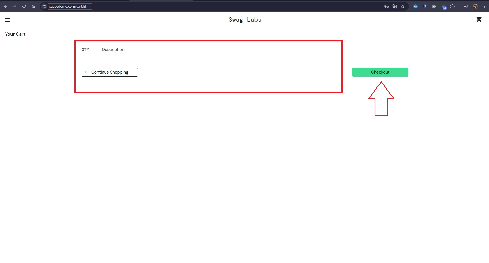
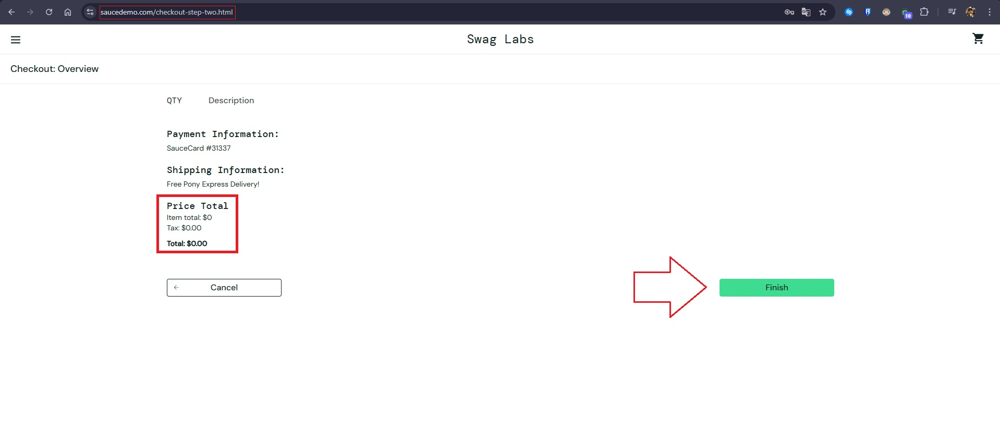
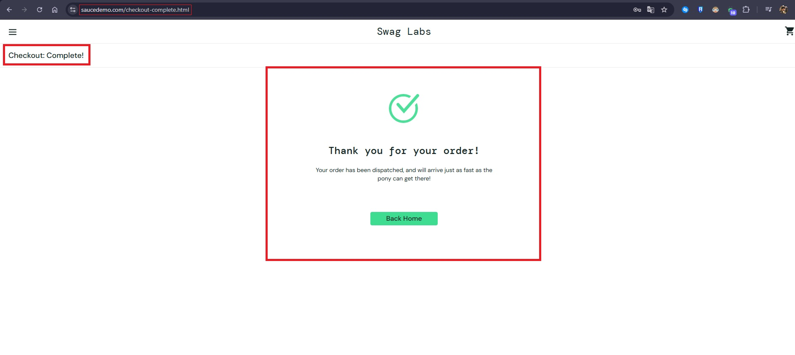

# Reporte de Bug

## Información General
- **ID del Bug:** sauceDemo-Cart-001
- **Título:** Permite realizar una compra con el carrito vacio.
- **Fecha de detección:** [31-07-2025]
- **Reportado por:** Francisco Conte
- **Entorno:** [Web / Chrome / Windows 11]
- **Estado:** [Nuevo]
- **Severidad:** [Alta]
- **Prioridad:** [Alta]

---

## Pasos para Reproducir

1. Ingresar a https://www.saucedemo.com/
2. Localizar el input de usuario (placeholder: "Username") y escribir un usuario valido.
3. Localizar el input de contraseña (placeholder: "Password") y escribir una contraseña valida.
4. Localizar el boton de login y clickear en el.
5. En la sección de inventory.html localizar el boton de carrito y clickear en el
6. Una vez en la sección de /cart.html con el carrito vacio localizar el boton de "Checkout" y clickear en el
7. Rellenamos con datos válidos los inputs de "First name", "Last name" y "Zip/Postal code"
8. Localizamos y clickeamos en el boton de "Continue"
9. Ahora en la sección de /checkout-step-two.html visualizamos que no hay productos a facturar y el "TOTAL" es $0
10. Localizamos y clickeamos en el boton de "Finish" para completar el circuito de compra.
11. Visualizamos que la compra/pedido fue confirmado. 

---

## Resultado esperado

Si tenemos el carrito vacio y nos encontramos en esa sección, deberia de frenarnos al clickear en el botón de "Checkout" advirtiendonos (con un toast por ej.) que debemos agregar un producto para poder proseguir con la compra.

---

## Evidencias

### Capturas

### Videos

** Recorded with Vidyard - Guarda videos en la nube

https://share.vidyard.com/watch/DbUjzjPsBuTMpJHxseqMXq