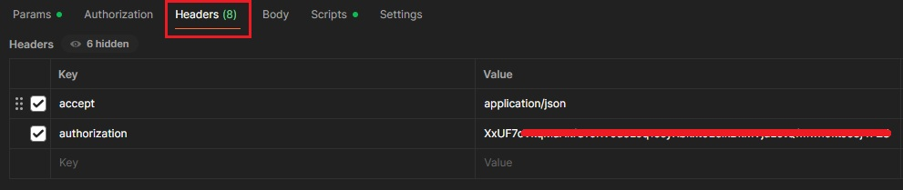
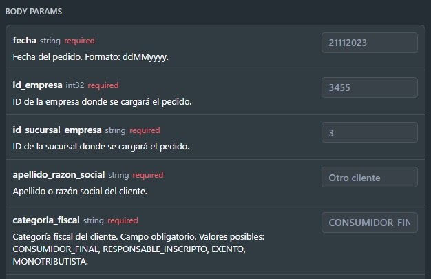
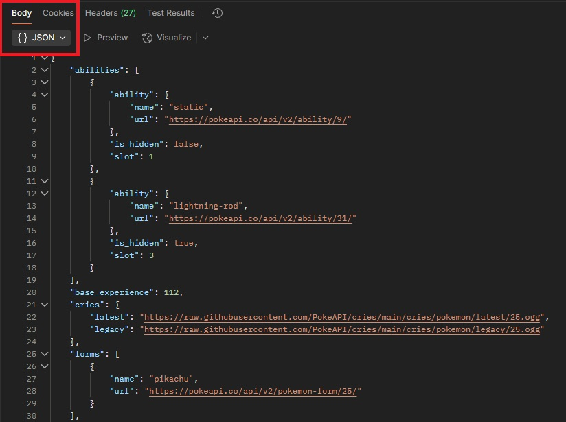
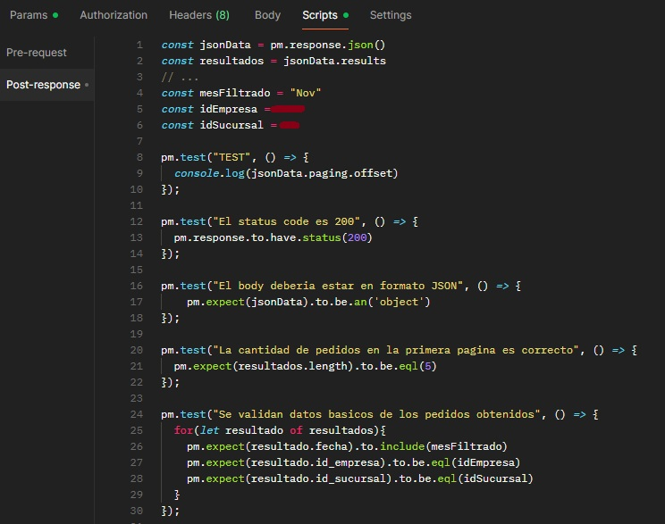

### [Seccion-1][Consigna-5] **Si tuvieras que hacer pruebas de APIs, indicá los pasos a seguir para poder llevarlas a cabo desde la definición hasta la ejecución**

# Como haria para realizar Pruebas de API (Manual)

## Introducción // aclacaración

La pagina https://www.saucedemo.com no tiene una API pública ni documentada. Por eso, a continuación se detalla un proceso hipotetico que seguiría para diseñar y ejecutar pruebas manuales sobre una API REST, en caso de contar con documentación y endpoints claros.

---

## 1. Conseguir la docu de la API. Se detalla cada item necesario con una breve explicación y ejemplo gráfico.

1. Obtener documentación oficial
En este caso https://www.saucedemo.com no posee una documentación publica, pero en un caso hipotetico deonde la tenga, empezaría por ahí.

2. Identificar la "estructura" permitida:
  - Endpoints disponibles (ej: `/api/login`, `/api/products`)
  Es a donde se quiere apuntar, que se quiere hacer. Intentamos probar un login? /api/login, intentamos obtener productos? /api/productos

  

  - Métodos HTTP permitidos (GET, POST, PUT, DELETE)
  Los metodos permitidos es la traducción de las ACCIONES permitidas via API, si quiero obtener información "GET", si quiero enviar/crear información "POST", si quiero modificar informacion "PUT" y por ultimo si quiero eliminar información se usa "DELETE"

  - Headers requeridos (ej: Authorization, Content-Type)
  En resumen, caracteristicas de la petición. Como credenciales (Authorization) y formato (Contet-type) aunque hay mas headers estos son los base.

  - Parámetros
  Los parametros o params son valores que van en la url del endpoint. Tenemos varios tipos de paramos, nombraré tres de ellos: 
  Los [PATH] params que son valores especificos que van la url para identificar recursos especificos. Por ej el id de un pokemon. EJ: [api/v2/pokemon/pikachu] donde pikachu hace referencia al id de un pokemon directamente.

  

  Por otro lado tenemos los [Query] params, estos se colocan en el endpoint luego del signo "?" generalmente se usan para filtrar y hay muchas formas y metodos para ello. No voy a detallar cada uno pero en definitva sirve para eso, como para ordenar ascendentemente resultados o mostrar resultados con un limite preestablecido.
  
  

  Por último tenemos los [Header] params, se usan para enviar información de "control" como token de autorización, tipo de contenido siendo tipo application/json el mas comun.

  

  - Body de entrada
  Se utiliza para enviar informacion, generalmente se utiliza en los metodos POST y PUT. Aca nuevamente juega la documentación, ya que el body tiene una estructura especifica que debe respetarse para enviar datos. No se puede enviar datos aleatoriamente, tienen que seguir una estructura previamente definida por la API. Esta se envia en formato Json generalmente.

  

  - Códigos de estado esperados (`200`, `400`, `401`, `404`, etc.)

  Establece el estado de la respuesta a través de un numero basicamente. 200 referencia a que el resultado de la peticion fue OK, 400 es que algo fallo como por ej un dato mal pasado en el body param, 401 hace referencia a que no estamos autorizados y 404 a que no se encontro el recurso, ya sea por el endpoint o otras causas.
  Esta bueno aclarar, pero no en todas las documentaciones está detallado, que cada código de repuesta puede estar relacionado a un mensaje que podriamos validar, como por ej "200 = Registro exitoso" 

  - Estructura y tipo de datos de la respuesta (JSON, XML)
  Como se estructurará la respuesta, estas estructuras pueden tener varios tipos, las mas usadas/conocidas son JSON principalemente y XML.

  

---

## 2. Posibles Casos de Prueba

- Se podrian tener en cuenta los siguientes escenarios base:
  - Casos positivos: enviar datos validos, esperar respuestas exitosas
  - Casos negativos: enviar datos invalidos o incompletos, validar errores acordes a lo enviado
  - Casos de seguridad: probar sin token
  - Casos de performance : multiples requests

---

## 3. Herramientas a utilizar (manual)

- Postman: para pruebas manuales de los endpoints REST.

- DevTools > Network en el navegador: para inspeccionar las llamadas que "triggerea" el front-end es super útil.

### [Seccion-1][Consigna-6] **¿Cómo escribirías un test de API? Ejemplifique.**

## 1. Casos típicos de como haría para crear pruebas API en Postman

1. Crear una colección con los endpoints a probar. Esa colección debe agrupar una funcionalidad o módulo, por ejemplo "Carrito" en el caso de saucedemo, donde englobaria todas las pruebas/peticiones relacionadas a la misma.
2. Configurar el entorno (URL base, variables, tokens). Esto se hace para "agilizar" y "ordenar" a la hora de realizar peticiones, por ej, si la URL base siempre será "https://www.saucedemo.com/" podriamos guardarla como una variable y llamarla siempre que la necesitemos, asi también con tokens y otros datos.
3. Al tener creada ya una coleccion, podemos empezar a crear las peticiones/pruebas individuales dentro de la misma. Para ello seleccionamos los metodo HTTP y URL del endpoint requerida para el test. 
4. Agregar datos como params, headers, body según corresponda (explicado anteriormente en la consigna 5.1.2)
5. Ejecutar y analizar:
   - Código de estado (200, 400, 401, etc..)
   - Estructura del body (Generalmente nos devuelve un json donde se espera cierta estructura, se puede comparar con la docu para ver si esta bien)
   - Mensajes devueltos (Si hicimos un caso negativo, el mensaje de error es correcto por ej?)
   - Tiempo de respuesta (Generalmente detallado en "ms", una respuesta con altos "ms" puede traducirse en lentitud en la pagina/sistema
   - Resultado de validaciones incluidas en los scripts de prueba (imagen adjuntada con ejemplo básico)
   
   

---

## 2. Reporte

La estructura es muy similar a la de una prueba manual, nada mas que cambian los resultados obtenidos y como se envian los datos. Esto varía segun la metodologia de reporte de cada equipo, es cuestión de ponerse de acuerdo y formular un reporte genérico que funcione.

- Documentar:
  - Pruebas ejecutadas
  - Datos usados
  - Resultados obtenidos
  - Errores detectados
  - Evidencias

---

## 3. Reejecución posterior

Al tenerlo en postman, se pueden guardar las colecciones para reutilizarlas cuando lo necesitemos, incluso se puede automatizar en una pipeline para que corra como regresión aunque no vaya al caso esta bueno mencionarlo.

- Una vez realizado un cambio en la pagina/sistema como un bug o una nueva funcionalidad, se vuelve a ejecutar:
  - Los mismos casos afectados
  - Casos de regresión relacionados

---

## Observación final

Aunque saucedemo.com no ofrece una API REST documentada, esta es mas o menos la metodología que utilizaría en un entorno real. En un entorno real, además integraría estas pruebas en pipelines de CI/CD y combinaría tests manuales con automatizados con Cypress.

